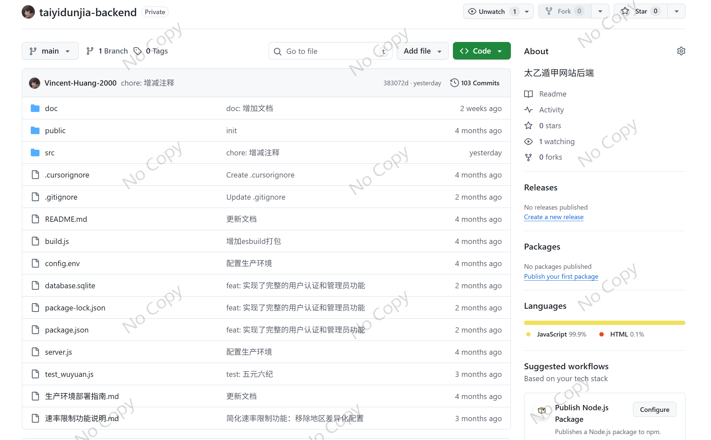
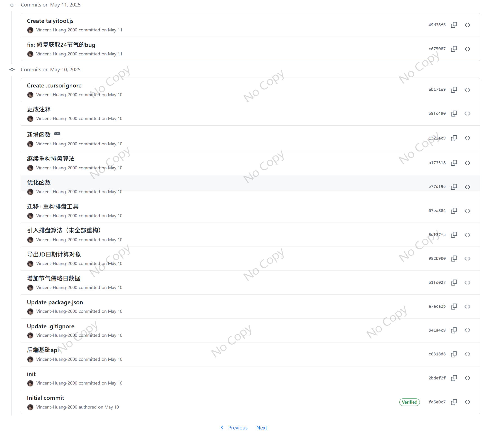
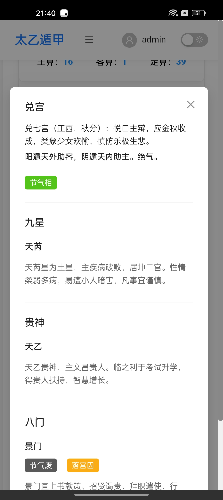

This project is relatively complex. Its difficulty does not lie primarily in the technical aspects, but rather in the need to transform textual descriptions from ancient Chinese classics into executable algorithms. It involves calculating the exact moments of the Winter Solstice and Summer Solstice, deriving the positions of certain astral deities (星神) through numerical accumulation, and arranging the **Shi Pan (式盘)**—a divination chart—used for predicting auspicious and inauspicious outcomes in human affairs.

In its early stage, the project was built purely with **React**. Later, I introduced the **Capacitor** framework. Regarding the project structure, I designed a fairly reasonable architectural plan (though unfortunately I cannot provide all of the specific code).

From an engineering perspective, this project follows a frontend–backend separation architecture. If you ask me why, I think I had a few considerations at the time:
1. As a personal practice project, I always like to try out new things (different architectures or frameworks). Exploring different directions helps me better understand the pros and cons behind various technologies. 
2. When developing this project, I also considered the possibility of commercializing the backend API, so I adopted a frontend–backend separation architecture.

Below is the mobile application developed using Capacitor (not yet released). If you would like to try the web version, you can visit [this link](https://taiyidunjia.com/). However, please note that the web version is missing newest features.

