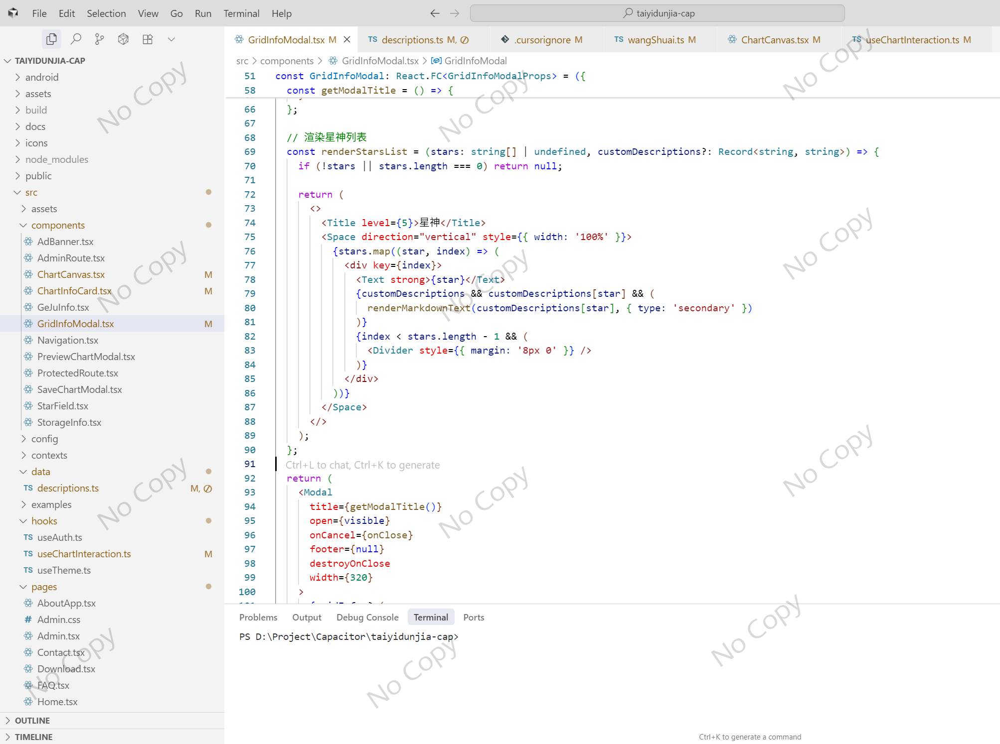
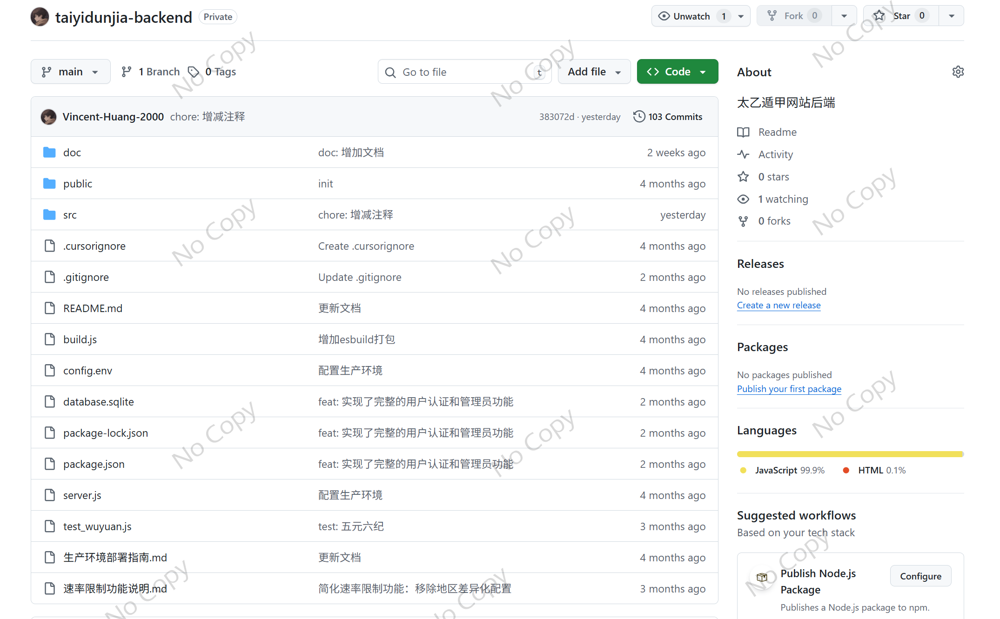
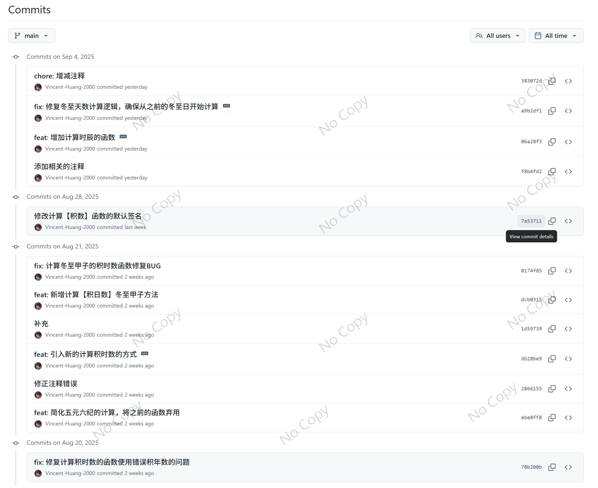
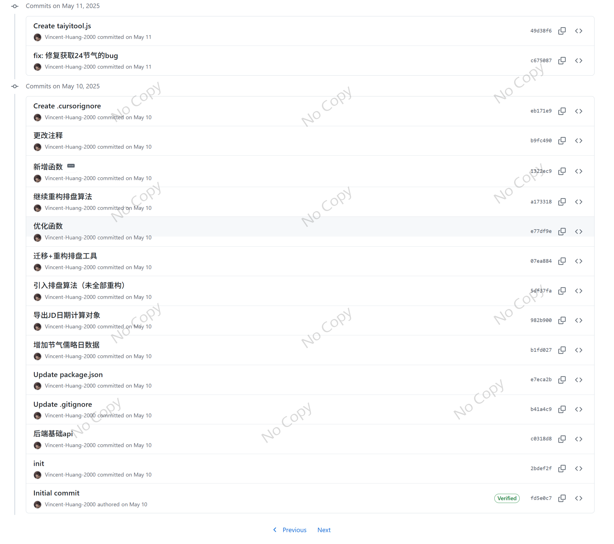
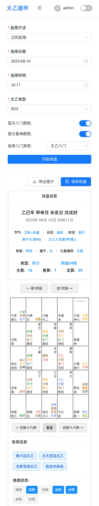
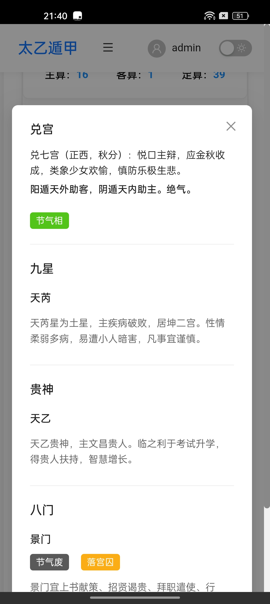

这个项目比较复杂，其难度不在于技术层面，而是需要将中国古籍中的文字转换成实际的算法。并且需要计算冬至、夏至的时刻，根据积数来计算星神，排列出式盘，以用来预测人事吉凶。

前期这是一个纯 React 项目，后续我还引入了 Capacitor 框架。关于项目的结构可参考以下，我对于项目的结构有一个比较合理的规划。（但是抱歉我不能提供所有的具体代码）

从工程的角度来说，这个项目是一个前后端分离的项目。如果你要问我为什么？我想我当时考虑了几点：
1. 作为一个我自己的练手项目，我总是喜欢尝试一些新的东西（不同的架构或者框架）。不同方向上的尝试能让我更好地发现不同技术背后的优缺点。
2. 开发这个项目的时候，我有考虑过后端 API 商业化可能性，因此采用了前后端分离的架构。

以下是引入 Capacitor 框架开发的 App （目前还没有发布）如果你想体验网页版可以点击[这里](https://taiyidunjia.com/)，但注意网页版缺少部分功能。

