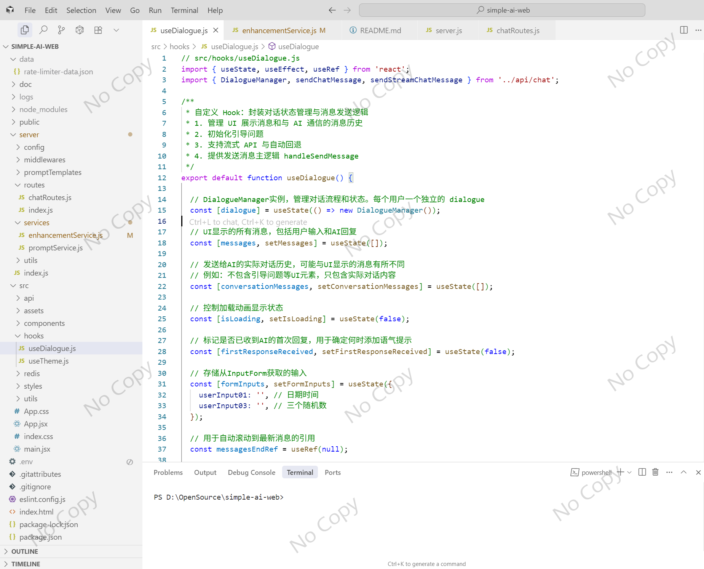
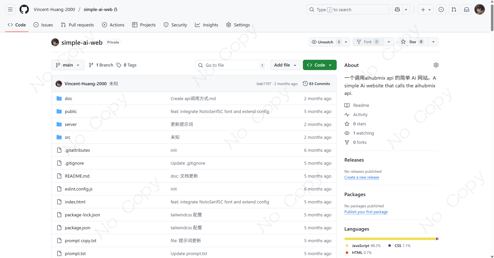
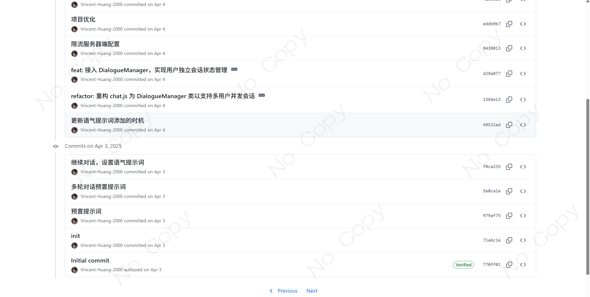

1. **Project Overview**
This is a full-stack AI conversation application based on React + Express, adopting a frontend-backend separated architecture. The frontend uses React to build the interactive interface, while the backend provides API services via Express and integrates AI capabilities from AIHubMix. The project implements core features such as a guided conversation flow, streaming message response, and a two-stage AI processing mechanism, delivering an intelligent conversational experience for users.

2. **Technical Highlights**
- Implemented dual-mode API calls (streaming and regular), prioritizing SSE technology for real-time message pushing.
- Developed a dynamic prompt building service supporting multiple template loading and tone/style switching.
- Adopted a two-stage AI processing mechanism: obtaining an initial reply first, then generating an enhanced result.
- Integrated security middleware like request rate limiting and input validation to ensure system stability.
- Utilized a custom Hook (useDialogue) to manage complex dialogue state and guide the conversation flow.

3. **Project Achievements**
- Built a complete AI dialogue system supporting both guided Q&A collection and free conversation modes.
- Implemented conversation persistence, allowing users to restore historical sessions upon page refresh.
- Developed a real-time logging system to record complete dialogue flows for analysis and optimization.
- Simplified environment configuration and deployment processes through Docker containerization.
- Wrote unit tests and integration tests to ensure the reliability of core functionalities.

