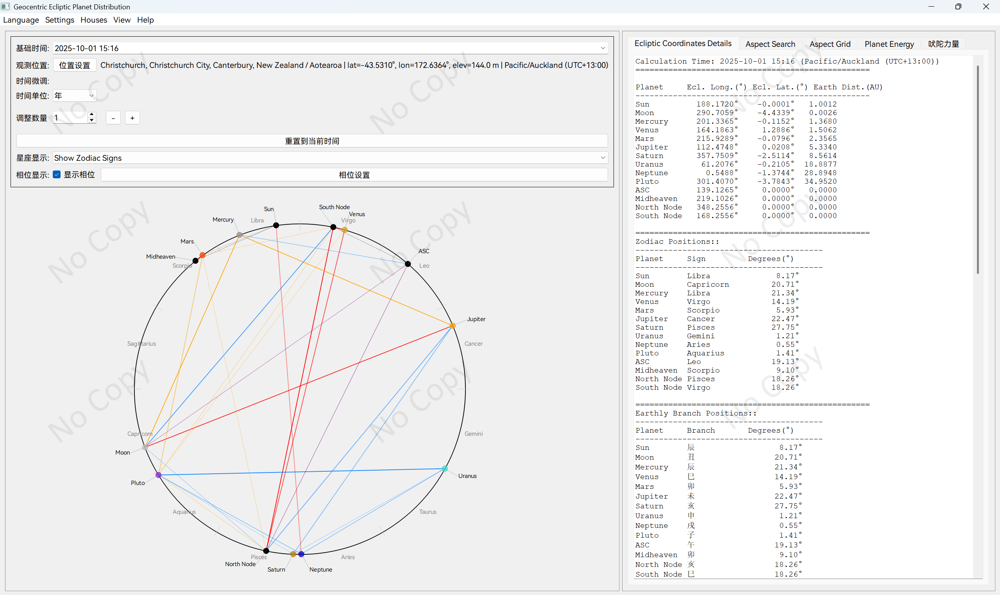
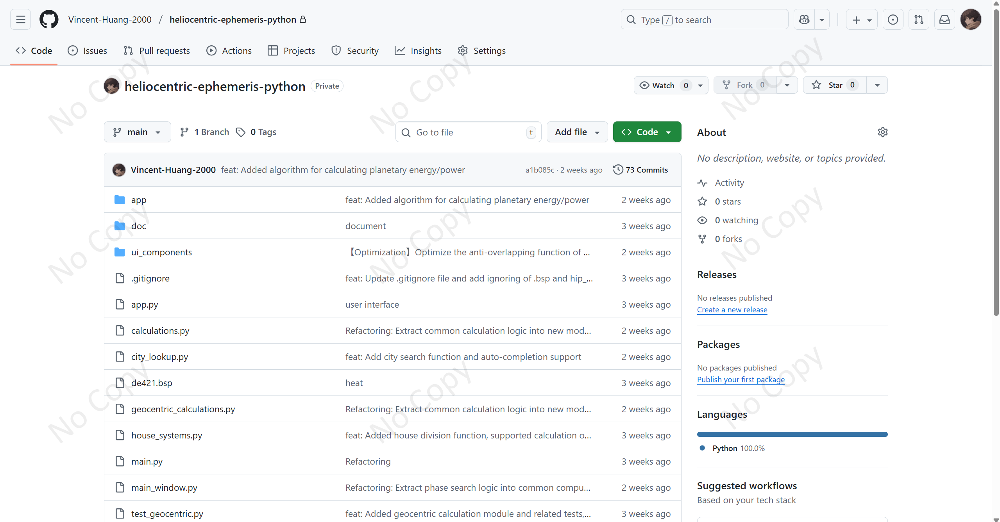

Heliocentric Ecliptic Planet Distribution — Professional Astrological Calculation Software

Project summary
Developed a professional astrological calculation application in Python with a PyQt5 GUI. The software supports both heliocentric and geocentric calculation modes, integrates modern astronomical algorithms with traditional astrological techniques, and provides precise planetary position calculations, aspect (phase) analysis, and Vedic astrology features.

Tech stack

* Backend computations: Python, Skyfield astronomical library, JPL ephemeris data
* Frontend: PyQt5 with custom drawing components
* Data processing: NumPy and scientific computation algorithms
* Configuration: Modular configuration system with multilingual support

Key features

1. Dual-system calculation engine

   * Heliocentric mode: planetary position calculations centered on the Sun
   * Geocentric mode: Earth-centric observational calculations, supporting Ascendant (rising sign), Midheaven (MC), and house systems
   * Supports both the tropical zodiac and the sidereal (stellar) zodiac coordinate systems

2. Precise aspect analysis

   * Implements nine principal aspects (e.g., conjunction, opposition, trine).
   * Supports customizable aspect orb tolerances and distance-adjustment algorithms.
   * Provides an aspect-search function to locate exact aspect occurrences within a specified time range.

3. Vedic astrology integration

   * Implements the Shadbala (sixfold planetary strength) calculation system.
   * Supports the Twenty-Eight Mansions (Chinese lunar mansions), the Twelve Earthly Branches, and other traditional elements.
   * Integrates planetary velocity analysis and retrograde detection.

4. Visualization and UI

   * Interactive natal chart rendering with pan and zoom.
   * Orbit path rendering and visualized house systems.
   * Bilingual UI (Chinese / English) and customizable display settings.

5. Advanced capabilities

   * Automatic timezone calculation and location management.
   * Planetary energy analysis and aspect tables.
   * Persistent configuration and user-preference management.

Technical highlights

* Used Brent’s method and Newton’s method for high-precision search of exact aspect times.
* Implemented a comprehensive astrology computation library including precession correction and house calculations.
* Modular architecture supporting multiple BSP ephemeris file formats.
* Integrated label collision-avoidance algorithm to optimize UI readability.

Project value
Combined the computational precision of modern astronomy with traditional astrological theory to deliver a professional-grade tool for researchers and enthusiasts; demonstrates strengths in scientific computing, algorithm optimization, and user interface design.

