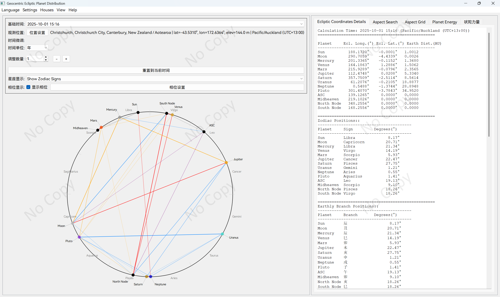
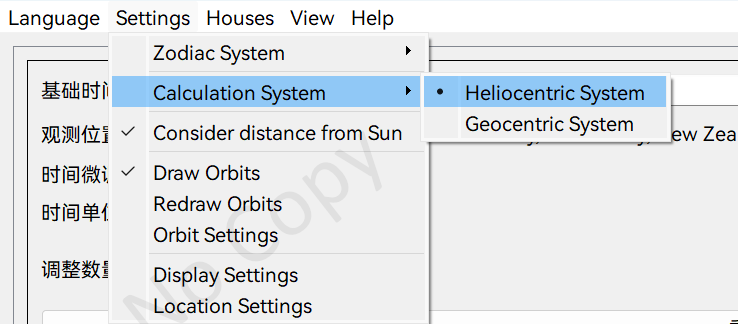
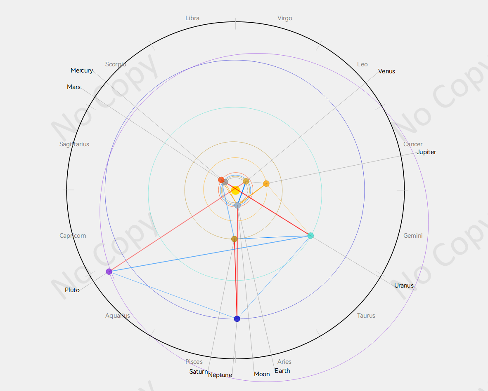

## 日心黄道行星分布图 - 专业占星计算软件

**项目概述：**
开发了一款基于Python和PyQt5的专业占星计算软件，支持日心和地心双系统计算，集成了现代天文学算法与传统占星理论，提供精确的行星位置计算、相位分析和吠陀占星功能。

**技术栈：**

- **后端计算**：Python + Skyfield天文库 + JPL星历数据
- **前端界面**：PyQt5 + 自定义绘图组件
- **数据处理**：NumPy + 科学计算算法
- **配置管理**：模块化配置系统 + 多语言支持

**核心功能：**

1. **双系统计算引擎**
   - 日心系统：以太阳为中心的行星位置计算
   - 地心系统：从地球视角的观测计算，支持上升点、中天、宫位系统
   - 支持热带黄道和恒星黄道两种坐标系统

2. **精确相位分析**
   - 实现9种主要相位计算（合相、对冲、三分相等）
   - 支持相位容差自定义和距离调整算法
   - 提供相位查找功能，可搜索特定时间范围内的精确相位时刻

3. **吠陀占星集成**
   - 实现Shadbala（六大力量）计算系统
   - 支持二十八星宿、十二地支等传统占星元素
   - 集成行星速度分析和逆行检测

4. **可视化界面**
   - 交互式星盘绘制，支持缩放和平移
   - 轨道路径显示和宫位系统可视化
   - 多语言界面（中英文）和自定义显示设置

5. **高级功能**
   - 时区自动计算和位置管理
   - 行星能量分析和相位表格
   - 配置持久化和用户偏好管理

**技术亮点：**

- 使用Brent算法和牛顿法实现高精度相位时间搜索
- 实现了完整的占星计算算法库，包括岁差修正、宫位计算等
- 采用模块化架构，支持多种BSP星历文件格式
- 集成了防重叠标签算法，优化用户界面体验

**项目价值：**
该项目结合了现代天文学计算精度与传统占星理论，为占星研究者和爱好者提供了专业级的计算工具，展现了在科学计算、算法优化和用户界面设计方面的综合技术能力。

